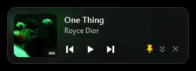
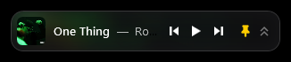

<h1 align="center">Ya Mini Player</h1>

<p align="center">
  <b>A tiny floating remote for Yandex Music on Windows.</b><br>
  Always on top. 39 KB. No install, no login.
</p>

<p align="center">
  <br>
  
</p>

<p align="center">
  <a href="../../raw/main/download/YaMiniPlayer.zip"><b>Download YaMiniPlayer.zip</b></a>
</p>

---

## What it does

- **Play / pause, next, previous** for whatever Yandex Music is playing
- **Track title, artist and album art**, with the cover softly blurred into the background
- **Always on top**, with a pin button to switch it off (yellow pin = pinned)
- **Two sizes**: full and compact, one click to switch
- **Drag it anywhere**; it remembers its place, size and pin state
- **One small `.exe`**: nothing to install, nothing running in the background

## Get started

1. Download [YaMiniPlayer.zip](../../raw/main/download/YaMiniPlayer.zip) and unzip it.
2. Start Yandex Music (the desktop app, or music.yandex.ru in a browser) and play something.
3. Run `YaMiniPlayer.exe`.

> **"Windows protected your PC"?** The app is not code-signed, so SmartScreen warns on first run.
> Click **More info**, then **Run anyway**. The full source is in this repo if you would rather build it yourself.

## Controls

| Action | How |
| --- | --- |
| Move | Drag anywhere on the player |
| Switch size | Double-arrow button, or double-click the player |
| Always on top | Pin button, or right-click menu |
| Open Yandex Music | Press play when nothing is playing, or right-click menu |
| Quit | Close button (full size), or right-click and choose Exit |

## How it works

Ya Mini Player never talks to Yandex. It uses the same Windows media controls that power the
volume flyout and your keyboard's media keys (`GlobalSystemMediaTransportControlsSessionManager`).
Yandex Music tells Windows what is playing; the mini player reads that and sends play, pause and
skip commands back.

That means:

- No account, token or password is ever requested.
- It prefers the Yandex Music desktop app. If that is not running, it controls whatever Windows
  reports as the current media player, such as a browser tab.

## Build from source

No SDK needed. The build script uses the C# compiler that ships with Windows.

```powershell
powershell -ExecutionPolicy Bypass -File build.ps1
```

The result is `dist\YaMiniPlayer.exe`.

| File | Purpose |
| --- | --- |
| `src/Player.cs` | App logic: media session, settings, window behaviour |
| `src/Player.xaml` | The player's layout and styling |
| `build.ps1` | Generates the icon and compiles the app |

Requires Windows 10 (1809 or later) or Windows 11.

## По-русски

Маленький плавающий пульт для Яндекс Музыки: поверх всех окон, с обложкой, названием трека и
кнопками управления. Скачайте [архив](../../raw/main/download/YaMiniPlayer.zip), распакуйте, включите
музыку и запустите `YaMiniPlayer.exe`. Если Windows покажет предупреждение SmartScreen, нажмите
«Подробнее», затем «Выполнить в любом случае». Логин не нужен: приложение использует стандартные
медиа-кнопки Windows.

## License

[MIT](LICENSE). Not affiliated with or endorsed by Yandex. "Yandex Music" is a trademark of its owner.
